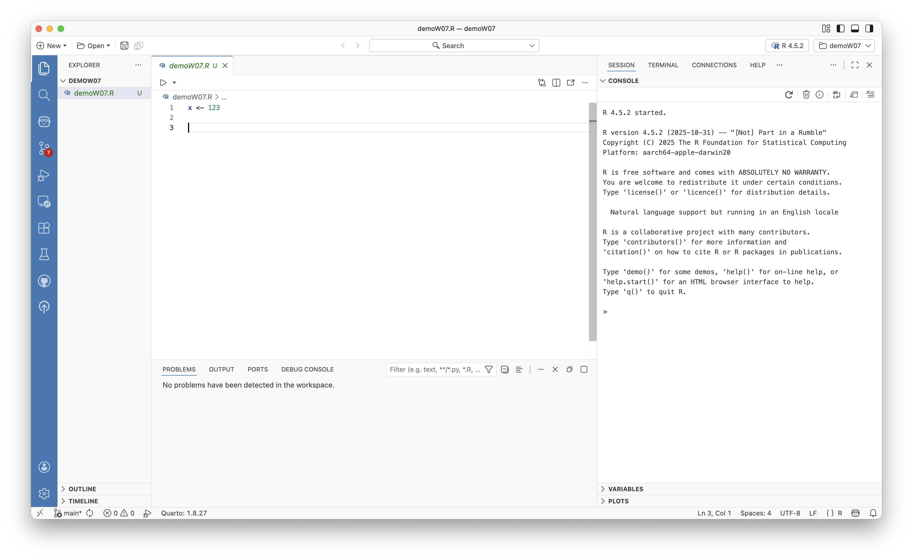

# Purpose:

::: callout-note
Reflect on how Position works with RStudio and the capabilities a user has when utilizing both. The reflection covers topics on installing Positron, working with AI, and publishing.
:::

# Becoming Familiar with Positron

## **Prompt:** Download and Install Positron. As you watch the videos in Step 1 and Step 3, follow the activities in the video and be familiar with Positron.

### **Positron Notes:**

::: panel-tabset
## RStudio

Customized for Data Science

## VSCode

Fast & Flexible, Great AI integration

## Positron

Positron uses both RStudio and VSCode features to produce efficient and powerful datasets and visualizations.
:::

-   In Positron you can specify what version of R you want to work with.

    -   You have access to `Positron Assistant an AI chat provider`. This assistant allows you to input requests and gets you an output connected to GitHub Copilot.

    -   In editor you can write code, run the code in console, and view outputs like plots, variables, and reports in both RStudio and Positron.

-   The ***command palette*** is integral in Positron. It serves as a search engine, where you can type keywords or names of commands to run them in the system. (e.g. "I want to do blank in Positron," you would type that into the command palette)

-   ***Development moves*** such as "check", "document," or "load all" are working commands in the Command Palette[^1] in Positron that serve a similar purpose as the **build** pane in RStudio.

[^1]: You can type commands like "check", "document", or "load all" to run actions, similar to RStudio's build pane.

# Steps 1 Video & Step 3 Video Reflection

## **Prompt:** Based on what you learned from Step 1 and Step 3, what do you like about Positron compared with RStudio?

**Reflection Response:** After watching the step 1 and step 3 videos, I realized that RStudio and Positron are quite similar and work hand-in-hand at times. Both of the systems' layouts contain write, run, and understand sections. As shown in Figure 2, you can see the main panels of Positron. Where you can write code, run the code, and understand visualizations of the code within RStudio and Positron. Personally, I value the effectiveness and efficiency that Positron is capable of. I like that Positron has the in-house option to use an ***AI powered assistant*** tell help you develop your code and solve issues. In Positron you can also look at a dataset in closer detail. The `data can be filtered` by column, value, and specific categories all within the project. It is beneficial that adding filters will not alter your data. Plots can undergo filtering as well, turning on dark and light modes depending on the user preference.

# Step 4: How can AI be used in Positron?

## **Prompt:** The video demonstrates how you can use AI. Respond to the following:

### Describe the various ways you can use AI inside Positron.

**Response:** You can access it through the button that appears as a robot face in Positron on the left-hand side of the page. AI in Positron utilizes your environment for context, there on providing suggestions that are related to your data, plots, tables, and code. It can also give the user inline code suggestions. Further, the `Databot` analyzing data assistant extension can be downloaded for additional convenience. Further, the `Databot` analyzing data assistant extension can be downloaded for additional convenience. This is useful when you want fast exploratory data analysis.

> Learning how to code is challenging; AI tools are supportive to developing skills as a beginner coder.

### Which AI tools have you installed or set up? Which AI tools did you find beneficial for you?

**Response:** Although I do not have experience in using AI tools within RStudio or Positron, I have used AI before. Some AI tools that I have utilized in the past are ***ChatGPT*** and ***Google Gemini***. Both AI tools have proven beneficial to me when I've used them. ChatGPT is especially helpful for problem-solving and Gemini is convenient when using other Google services. My critique for AI tools is that it requires a great amount of information and detail if you want accurate results. After learning about the AI Positron Assistant, I believe this is a great feature to add to a coding platform.

| AI Tool        | Purpose                        | Helpful/Not |
|----------------|--------------------------------|-------------|
| GitHub Copilot | Inline code suggestions        | Helpful     |
| ChatGPT        | Problem-solving & explanations | Helpful     |
| Google Gemini  | Research / information         | Helpful     |

### Applying For GitHub Copilot

**(1) Apply for it and take a screenshot showing you were accepted into the education program.**

**(2) Play with it and do you find it helpful or distracting? Please elaborate.**

**Helpful or Distracting?**

For the most part AI tools like GitHub Copilot has been helpful. However, like any AI tool it is not perfect and requires accurate information to produce relevant output. There isn't much opportunity for the AI to be "distracting" unless it is suggesting an abundance of solutions and it can become overwhelming. Users typically want the best answer when using AI, so when the AI produces many solutions the user might want to explore each avenue instead of actually solving the issue and moving on. Overall, the GitHub Copilot tool is helpful and reliable when working on Positron.

# Publish the report to GitHub Pages

## GitHub Pages Link

The published report is available at:

<https://miap2324.github.io/Intro-Positron/>
